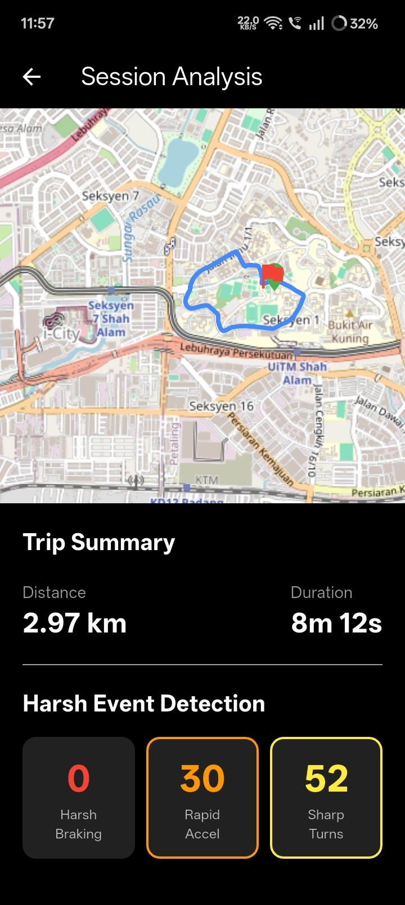

# Drive Buddy 🚗

A smartphone-based vehicle diagnostic and driving assistance application built with Flutter. Drive Buddy uses smartphone sensors and GPS to monitor driving sessions, visualize routes, and analyse driving behaviour.

## Overview

Drive Buddy is designed to help drivers better understand their driving behaviour through smartphone-based sensing and trip analysis.

The application collects location and motion data during a driving session and presents the results through an easy-to-understand mobile interface.

## Key Features

- 📍 **GPS Route Tracking**
  - Records and visualizes the driving route on a map.
  - Displays the route of a completed driving session.

- 🛣️ **Driving Session Tracking**
  - Tracks driving sessions using smartphone location and motion data.
  - Provides a summary of each completed session.

- 📊 **Session Analysis**
  - Displays trip distance and duration.
  - Summarizes detected driving events after a session.

- 🚨 **Harsh Event Detection**
  - Detects harsh braking events.
  - Detects rapid acceleration events.
  - Detects sharp turns.

- 🚗 **Vehicle Management**
  - Allows users to manage vehicle information within the application.

- 📖 **Driving Logbook**
  - Provides a logbook interface for reviewing driving-related records.

- 🤖 **AI-Assisted Chat**
  - Includes an in-app chatbot interface for driving/vehicle-related assistance.

- 🔐 **User Authentication**
  - Supports user registration and login.

## Screenshots

### Session Analysis

The Session Analysis screen provides a visual summary of a completed driving session, including route, distance, duration, and detected driving events.



## Technology Stack

### Mobile Development

- Flutter
- Dart

### Sensors & Location

- GPS / Location Services
- Accelerometer
- Gyroscope

### Backend & Data

- Firebase Authentication
- Cloud Firestore

### Maps & Visualization

- Flutter Map
- LatLong2
- FL Chart

### State Management & Utilities

- Provider
- Permission Handler
- HTTP
- Flutter Dotenv

### AI

- Google Generative AI

### Development Tools

- Git
- GitHub
- Figma

## How It Works

A typical driving session follows this workflow:

1. User logs into the application.
2. User selects or manages their vehicle.
3. User starts a driving session.
4. Drive Buddy collects location and motion data from the smartphone.
5. The application analyses driving events such as braking, acceleration, and turning.
6. The driving route is visualized on a map.
7. After the session ends, the application presents a session summary.
8. The user can review the session through the analysis and logbook features.

## Sensor Integration

Drive Buddy uses smartphone sensors to support driving-session analysis.

### GPS

GPS/location data is used to:

- Track the driving route.
- Calculate travel distance.
- Record location information during a session.

### Accelerometer

Accelerometer data is used as part of the driving-event detection process, including rapid acceleration and braking-related analysis.

### Gyroscope

Gyroscope data provides rotational motion information that can support the detection and analysis of turning behaviour.

## Project Structure

```text
lib/
├── models/
├── screens/
│   ├── add_new_car_screen.dart
│   ├── analysis_screen.dart
│   ├── car_list_screen.dart
│   ├── chatbot_screen.dart
│   ├── dashboard_screen.dart
│   ├── driving_session_screen.dart
│   ├── logbook_screen.dart
│   ├── login_screen.dart
│   ├── profile_screen.dart
│   ├── register_screen.dart
│   └── session_detail_screen.dart
└── main.dart
```
## Getting Started

### Prerequisites

Make sure you have the following installed:

- Flutter SDK
- Dart SDK
- Android Studio or another Flutter-compatible development environment
- Git

### Installation

Clone the repository:

```bash
git clone https://github.com/hadifnz/drive_buddy.git
```
Navigate into the project:
```bash
cd drive_buddy
```
Install dependencies:
```bash
flutter pub get
```
Run the application:
```bash
flutter run
```
Note: Some application services require environment variables and Firebase configuration. Configure these according to your development environment before running the complete application.

## Project Status

Drive Buddy was developed as a mobile application project focusing on smartphone-based vehicle monitoring, driving-session tracking, and driving behaviour analysis.

## Future Improvements

### Potential improvements include:

- Improving driving-event detection accuracy.
- Expanding vehicle diagnostic capabilities.
- Adding more detailed driving analytics.
- Improving data visualization.
- Expanding AI-assisted vehicle support.
- Supporting additional sensor-based driving insights.

## Author

## Muhammad Hadif Nazrujehan

### GitHub: https://github.com/hadifnz
### Portfolio: https://www.hadifnazrujehan.my/
### LinkedIn: https://www.linkedin.com/in/hadifnazrujehan
